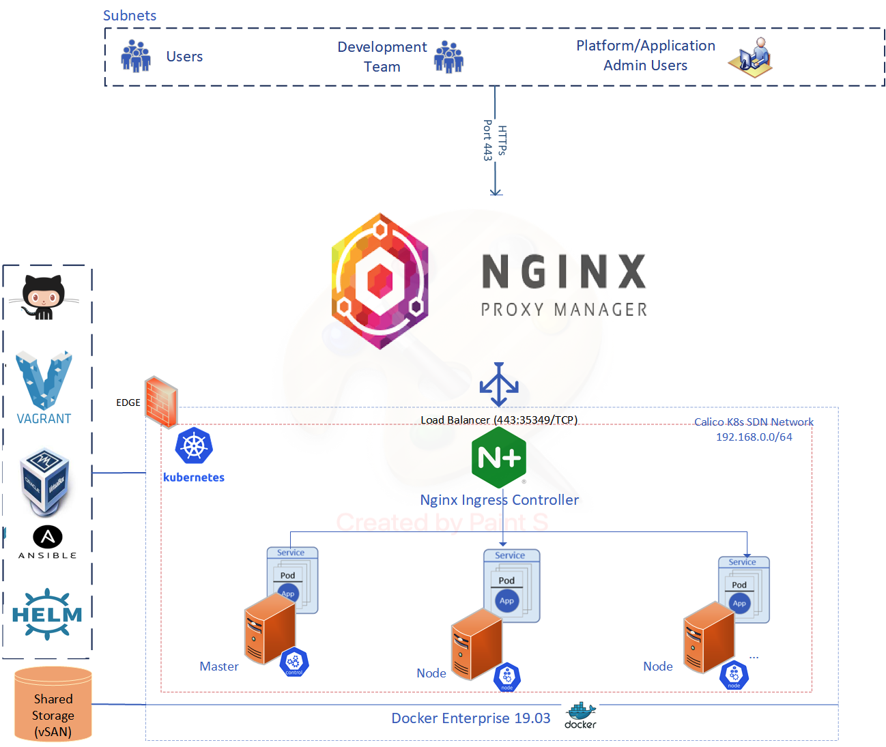

# Production Ready Kubernetes Cluster Using Vagrant

## Overview


This project describes the steps required to setup a multi-node Kubernetes Cluster for Oodo Deployment.
The repository contains a Vagrantfile, [Kubespray](https://github.com/kubernetes-sigs/kubespray), a Kubernetes Implementation and bootstrap helm charts to deploy the cluster. The automation framework implemented in this project will provision a Production ready full blown multi-node Kubernets Cluster under 30 minutes with Enterprise grade monitoring capability using [Kubernetes Dashboard](https://kubernetes.io/docs/tasks/access-application-cluster/web-ui-dashboard/), [Prometheus & Grafana](https://grafana.com/grafana/dashboards/315), [Kubeview](https://github.com/benc-uk/kubeview).
The implementation also includes Dynamic volume provisioning which allows storage volumes to be created on-demand. Without dynamic provisioning, cluster administrators have to manually make calls to their cloud or storage provider to create new storage volumes, and then create [PersistentVolume objects](https://kubernetes.io/docs/concepts/storage/persistent-volumes/) to represent them in Kubernetes.The dynamic provisioning feature eliminates the need for cluster administrators to pre-provision storage. Instead, it automatically provisions storage when it is requested by users. 


## Cluster Architecture



## Prerequisites
OS X & Linux:

- Virtualbox - https://www.virtualbox.org
- Vagrant - https://www.vagrantup.com
- Helm - https://helm.sh - v3 :)
- Ansible - https://www.ansible.com 
- Kubernetes v1.19+ - https://kubernetes.io/blog/2020/08/26/kubernetes-release-1.19-accentuate-the-paw-sitive/
- Kubespray - https://github.com/kubernetes-sigs/kubespray
- kubectl - https://kubernetes.io/docs/tasks/tools/install-kubectl-linux/https://direnv.net
- Nginx Proxy Manager - https://nginxproxymanager.com
- Dedicated Bridge connector exists
## Quickstart

Setup a new bridge connector in the host machine. This connector establishes a bridge between host and guest Virtual Machines(s)
```ShellSession
brctl addbr k8s-bridge
ifconfig k8s-bridge 192.168.0.1 netmask 255.255.255.0
ifconfig k8s-bridge up
```
Install nfs server on the host machine.
```ShellSession
yum install nfs-utils nfs-utils-lib
systemctl enable nfs-server
systemctl start nfs-server
```
Add entry in  "/etc/exports"
```ShellSession
/kube-data *(rw,sync,fsid=0,no_root_squash,no_subtree_check,insecure)
```
Exports all shared listed in "/etc/exports:
```ShellSession
exportfs -arv
```
Allow iptables 
```ShellSession
firewall-cmd --permanent --add-service=rpc-bind
firewall-cmd --permanent --add-service=mountd
firewall-cmd --permanent --add-port=2049/tcp
firewall-cmd --permanent --add-port=2049/udp
firewall-cmd --reload
```

Deploy nfs provisioner via helm chart.
Dynamic NFS Provisioning: is allows storage volumes to be created on-demand. The dynamic provisioning feature eliminates the need for cluster administrators to code-provision storage. Instead, it automatically provisions storage when it is requested by users. Persistent volumes are provisioned as ${namespace}-${pvcName}-${pvName}.
You will need a operational Kubernetes Cluster.
To deploy a NFS provisioner into the cluster you can run [provisioner.sh](provisioner.sh) script to deploy the nfs-provisioner helm chart.

To deploy a multi-node Kubernetes Deployment run the following steps:
Update [machines.yml](scripts/machines.yml) which describes the target node structure
```ShellSession
---
- box:
    name: "kube-master-01"
    type: "master"
    img: "boeboe/centos7-50gb"
    version: "1.0.1"
    eth1: "192.168.0.3"
    mem: "4096"
    cpu: "2"
- box:
    name: "kube-master-02"
    type: "master"
    img: "boeboe/centos7-50gb"
    version: "1.0.1"
    eth1: "192.168.0.4"
    mem: "4096"
    cpu: "2"
- box:
    name: "kube-master-03"
    type: "master"
    img: "boeboe/centos7-50gb"
    version: "1.0.1"
    eth1: "192.168.0.5"
    mem: "4096"
    cpu: "2"
....   
```
Run [provisioner.sh](provisioner.sh) scripts to deploy and bootstrap the cluster. [provisioner.sh](provisioner.sh) is a comprehensive self-service script used to build the Vagrant nodes, install Kubespray - https://github.com/kubernetes-sigs/kubespray  Kubernetes and helm charts.

Note: Option (A) shown below will deploy a Full blown Kubernetes Cluster and integrated ingress controller, Cluster monitoring and local storage provisioners under 30 minute(s).

```ShellSession

[qzhub@qzhub-dev-01 k8s_platform_scripts]$ ./provisioner.sh 
Vagrant VM Provisioner

Syntax: ./provisioner.sh -[P|I|D|A]
Example: ./provisioner.sh -P
options:
P     (P)Provision VM(s).
I     (I)Install K8s.
D     (D)Deploy K8s Bootstrap Charts 
A     (A)Provision VM(s), Install K8s and Deploy Charts

....   
```

## Platform End-points
- [Password protected Kubernetes Dashboard] (https://k8s.qzhub.kz/)
- [Password protected Prometheus & Grafana Monitoring] (http://grafana.qzhub.kz)
- [Password protected Kubernetes Structure View](http://kubeview.qzhub.kz/)
- [A smoketest utility shows Cluster health, configurations & versions] (http://smoketest.qzhub.kz/)

## Dynamic Storage

Dynamic storage provisioners are enabled using [Local Path Provisioner](https://github.com/assign101/local-provisioner/blob/master/README.md_), provides a way for the Kubernetes users to utilize the local storage in each node. Based on the user configuration, the Local Path Provisioner will create `hostPath` based persistent volume on the node automatically. It utilizes the features introduced by Kubernetes [Local Persistent Volume feature](https://kubernetes.io/blog/2018/04/13/local-persistent-volumes-beta/), but make it a simpler solution than the built-in `local` volume feature in Kubernetes.

A Kubernetes [Storage-Class](https://kubernetes.io/docs/concepts/storage/storage-classes/) "local-path" will be created automatically to factilitate Dynamic local storage provisioning.

Dunamic storage provisioners simplifies the deployment and management of storage provisioning for StatefulSet deployments such as Postgres and Oodo Deployments.

Prometheus & Grafana monitoring is enabled as Statefulset deployment as show below.

```ShellSession
local-path-storage   local-path-provisioner-5696dbb894-95r79                  1/1     Running   0          18h
monitoring           alertmanager-monitoring-kube-prometheus-alertmanager-0   2/2     Running   0          18h
monitoring           monitoring-grafana-79b7497c9c-74n28                      2/2     Running   0          18h
monitoring           monitoring-kube-prometheus-operator-57c94f897f-snm48     1/1     Running   0          18h
monitoring           monitoring-kube-state-metrics-6bfb865c69-28wkv           1/1     Running   0          18h
monitoring           monitoring-prometheus-node-exporter-2s86r                1/1     Running   0          18h
monitoring           monitoring-prometheus-node-exporter-7fp5z                1/1     Running   0          18h
monitoring           monitoring-prometheus-node-exporter-dmkgw                1/1     Running   0          18h
monitoring           monitoring-prometheus-node-exporter-hh6k6                1/1     Running   0          18h
monitoring           monitoring-prometheus-node-exporter-jhftf                1/1     Running   0          18h
monitoring           monitoring-prometheus-node-exporter-lzchf                1/1     Running   0          18h
monitoring           monitoring-prometheus-node-exporter-mt4fz                1/1     Running   0          18h
monitoring           monitoring-prometheus-node-exporter-p9z4w                1/1     Running   0          18h
monitoring           prometheus-monitoring-kube-prometheus-prometheus-0       2/2     Running   37         18h
smoketest            smoketest-helm-smoketest-9qfmd                           1/1     Running   0          18h
smoketest            smoketest-helm-smoketest-bbkrh                           1/1     Running   0          18h
smoketest            smoketest-helm-smoketest-bqxc2                           1/1     Running   0          18h
smoketest            smoketest-helm-smoketest-n98c4                           1/1     Running   0          18h
smoketest            smoketest-helm-smoketest-t85d2                           1/1     Running   0          18h
[qzhub@qzhub-dev-01 k8s_platform_scripts]$ 

[vagrant@kube-master-01 shared-data]$ pwd
/shared-data
[vagrant@kube-master-01 shared-data]$ ls -altr
total 8
dr-xr-xr-x. 19 root    root     258 Apr  3 04:18 ..
drwxrwxr-x.  1 vagrant vagrant 4096 Apr  3 04:51 pvc-a71bfb78-8468-4319-b8f9-bd4b45d39a27_monitoring_prometheus-monitoring-kube-prometheus-prometheus-db-prometheus-monitoring-kube-prometheus-prometheus-0
drwxrwxr-x.  1 vagrant vagrant 4096 Apr  3 05:47 .
[vagrant@kube-master-01 shared-data]$ 

```
## Supported Linux Distributions

- **Debian** Buster, Jessie, Stretch, Wheezy
- **Ubuntu** 16.04, 18.04, 20.04
- **CentOS/RHEL** 7, 8 (experimental: see [centos 8 notes](docs/centos8.md))
- **Fedora** 31, 32
- **Fedora CoreOS** (experimental: see [fcos Note](docs/fcos.md))
- **openSUSE** Leap 42.3/Tumbleweed
- **Oracle Linux** 7, 8 (experimental: [centos 8 notes](docs/centos8.md) apply)

Note: The list of validated [docker versions](https://kubernetes.io/docs/setup/production-environment/container-runtimes/#docker) is 1.13.1, 17.03, 17.06, 17.09, 18.06, 18.09 and 19.03. The recommended docker version is 19.03. The kubelet might break on docker's non-standard version numbering (it no longer uses semantic versioning). To ensure auto-updates don't break your cluster look into e.g. yum versionlock plugin or apt pin).
